# Dogecoin Core - Complete Architecture Mermaid Diagram

```mermaid
graph TB
    %% Application Layer
    subgraph "Application Layer"
        DOGEAPP["🐕 Dogecoin Core Applications"]
        DOGEAPP --> DOGEIND["dogecoind<br/>(Daemon)"]
        DOGEAPP --> DOGEQT["dogecoin-qt<br/>(GUI)"]
        DOGEAPP --> DOGECLI["dogecoin-cli<br/>(CLI)"]
        DOGEAPP --> DOGETX["dogecoin-tx<br/>(Transaction Tool)"]
    end

    %% GUI Layer
    subgraph "Qt GUI Layer"
        QTMAIN["bitcoin.cpp<br/>(Main Qt App)"]
        QTGUI["bitcoingui.h/cpp<br/>(Main Window)"]
        QTMODEL["clientmodel.h/cpp<br/>(Data Models)"]
        QTWALLET["walletmodel.h/cpp<br/>(Wallet Model)"]
        QTWALLETVIEW["walletview.h/cpp<br/>(Wallet View)"]
        QTMODERN["modern*.h/cpp<br/>(Modern UI)"]
        QTTHEMES["themes/<br/>(Theme System)"]
        
        QTMAIN --> QTGUI
        QTGUI --> QTMODEL
        QTGUI --> QTWALLET
        QTGUI --> QTWALLETVIEW
        QTGUI --> QTMODERN
        QTGUI --> QTTHEMES
    end

    %% Core Libraries
    subgraph "Core Libraries"
        LIBSERVER["libdogecoin_server.a<br/>(Server Functions)"]
        LIBCOMMON["libdogecoin_common.a<br/>(Common Utils)"]
        LIBCONSENSUS["libdogecoin_consensus.a<br/>(Consensus Rules)"]
        LIBCLI["libdogecoin_cli.a<br/>(CLI Functions)"]
        LIBUTIL["libdogecoin_util.a<br/>(Utilities)"]
        LIBWALLET["libdogecoin_wallet.a<br/>(Wallet)"]
        LIBQT["libdogecoinqt.a<br/>(Qt Components)"]
    end

    %% Consensus Layer
    subgraph "Consensus Layer"
        CONSCORE["consensus.h<br/>(Core Rules)"]
        CONSPARAMS["params.h<br/>(Parameters)"]
        CONSVALID["validation.h/cpp<br/>(Validation)"]
        CONSMERKLE["merkle.h<br/>(Merkle Trees)"]
        CONSTXVERIFY["tx_verify.h/cpp<br/>(TX Verification)"]
        DOGECORE["dogecoin.h/cpp<br/>(Dogecoin Logic)"]
        
        CONSCORE --> CONSPARAMS
        CONSCORE --> CONSVALID
        CONSCORE --> CONSMERKLE
        CONSCORE --> CONSTXVERIFY
        CONSCORE --> DOGECORE
    end

    %% Core Components
    subgraph "Core Components"
        CHAIN["chain.h/cpp<br/>(Blockchain)"]
        CHAINPARAMS["chainparams.h/cpp<br/>(Network Params)"]
        POW["pow.h/cpp<br/>(Proof of Work)"]
        MINER["miner.h/cpp<br/>(Mining)"]
        AUXPOW["auxpow.h/cpp<br/>(AuxPoW)"]
        BLOCK["block.h/cpp<br/>(Blocks)"]
        TX["transaction.h/cpp<br/>(Transactions)"]
        
        CHAIN --> CHAINPARAMS
        CHAIN --> POW
        CHAIN --> MINER
        CHAIN --> AUXPOW
        CHAIN --> BLOCK
        CHAIN --> TX
    end

    %% Network Layer
    subgraph "Network Layer"
        NET["net.h/cpp<br/>(P2P Network)"]
        NETPROC["net_processing.h/cpp<br/>(Message Processing)"]
        ADDRMAN["addrman.h/cpp<br/>(Address Management)"]
        PROTOCOL["protocol.h/cpp<br/>(Protocol)"]
        ADDRDB["addrdb.h/cpp<br/>(Address Database)"]
        
        NET --> NETPROC
        NET --> ADDRMAN
        NET --> PROTOCOL
        NET --> ADDRDB
    end

    %% Wallet Layer
    subgraph "Wallet Layer"
        WALLET["wallet.h/cpp<br/>(Core Wallet)"]
        WALLETDB["walletdb.h/cpp<br/>(Wallet DB)"]
        CRYPTER["crypter.h/cpp<br/>(Encryption)"]
        RPCWALLET["rpcwallet.h/cpp<br/>(Wallet RPC)"]
        
        WALLET --> WALLETDB
        WALLET --> CRYPTER
        WALLET --> RPCWALLET
    end

    %% RPC Layer
    subgraph "RPC Layer"
        RPCSERVER["server.h/cpp<br/>(RPC Server)"]
        RPCCLIENT["client.h/cpp<br/>(RPC Client)"]
        RPCBLOCKCHAIN["blockchain.h/cpp<br/>(Blockchain RPC)"]
        RPCMINING["mining.h/cpp<br/>(Mining RPC)"]
        RPCNET["net.h/cpp<br/>(Network RPC)"]
        RPCTX["rawtransaction.h/cpp<br/>(TX RPC)"]
        
        RPCSERVER --> RPCBLOCKCHAIN
        RPCSERVER --> RPCMINING
        RPCSERVER --> RPCNET
        RPCSERVER --> RPCTX
    end

    %% Cryptographic Layer
    subgraph "Cryptographic Layer"
        CRYPTO["crypto/<br/>(Crypto Primitives)"]
        SECP256K1["secp256k1/<br/>(Elliptic Curves)"]
        HASH["hash.h/cpp<br/>(Hash Functions)"]
        PUBKEY["pubkey.h/cpp<br/>(Public Keys)"]
        KEY["key.h/cpp<br/>(Private Keys)"]
        SCRIPT["script/<br/>(Script Engine)"]
        
        CRYPTO --> SECP256K1
        CRYPTO --> HASH
        CRYPTO --> PUBKEY
        CRYPTO --> KEY
        CRYPTO --> SCRIPT
    end

    %% Storage Layer
    subgraph "Storage Layer"
        LEVELDB["leveldb/<br/>(Database)"]
        TXDB["txdb.h/cpp<br/>(Transaction DB)"]
        COINS["coins.h/cpp<br/>(UTXO Set)"]
        MEMPOOL["txmempool.h/cpp<br/>(Memory Pool)"]
        
        LEVELDB --> TXDB
        TXDB --> COINS
        TXDB --> MEMPOOL
    end

    %% Build System
    subgraph "Build System"
        CONFIGURE["configure.ac<br/>(Configuration)"]
        MAKEFILE["Makefile.am<br/>(Build Rules)"]
        BUILD["build-aux/<br/>(Build Scripts)"]
        DEPENDS["depends/<br/>(Dependencies)"]
        
        CONFIGURE --> MAKEFILE
        MAKEFILE --> BUILD
        BUILD --> DEPENDS
    end

    %% External Dependencies
    subgraph "External Dependencies"
        BOOST["Boost<br/>(C++ Utilities)"]
        QT5["Qt5<br/>(GUI Framework)"]
        OPENSSL["OpenSSL<br/>(Cryptography)"]
        LIBEVENT["libevent<br/>(Network Events)"]
        UNIVALUE["univalue<br/>(JSON)"]
        
        BOOST --> QT5
        QT5 --> OPENSSL
        OPENSSL --> LIBEVENT
        LIBEVENT --> UNIVALUE
    end

    %% Dogecoin-Specific Features
    subgraph "🐕 Dogecoin Features"
        DIGISHIELD["DigiShield<br/>(Difficulty Adjustment)"]
        AUXPOW["AuxPoW<br/>(Merge Mining)"]
        NOCAP["No Supply Cap<br/>(Inflationary)"]
        SUBSIDY["Block Subsidy<br/>(10,000 DOGE)"]
        
        DIGISHIELD --> AUXPOW
        AUXPOW --> NOCAP
        NOCAP --> SUBSIDY
    end

    %% Modern UI Features
    subgraph "🎨 Modern UI Features"
        THEMESYSTEM["Theme System"]
        THEMEMANAGER["Theme Manager"]
        MATRIX["Matrix Theme<br/>(Green Terminal)"]
        CYBERPUNK["Cyberpunk Theme<br/>(Neon Purple)"]
        NEON["Neon Theme<br/>(Electric Colors)"]
        FUTURISTIC["Futuristic Theme<br/>(Space Age)"]
        RETRO["Retro Theme<br/>(80s/90s)"]
        MINIMAL["Minimal Theme<br/>(Clean)"]
        LIGHT["Light Theme<br/>(Professional)"]
        DARK["Dark Theme<br/>(Sophisticated)"]
        BASIC["Basic Theme<br/>(Default)"]
        
        THEMESYSTEM --> THEMEMANAGER
        THEMEMANAGER --> MATRIX
        THEMEMANAGER --> CYBERPUNK
        THEMEMANAGER --> NEON
        THEMEMANAGER --> FUTURISTIC
        THEMEMANAGER --> RETRO
        THEMEMANAGER --> MINIMAL
        THEMEMANAGER --> LIGHT
        THEMEMANAGER --> DARK
        THEMEMANAGER --> BASIC
    end

    %% Bitcoin Legacy (Needs Rebranding)
    subgraph "⚠️ Bitcoin Legacy (Rebrand Needed)"
        BITCOINDFILE["bitcoind.cpp<br/>→ dogecoind.cpp"]
        BITCOINCLIFILE["bitcoin-cli.cpp<br/>→ dogecoin-cli.cpp"]
        BITCOINTXFILE["bitcoin-tx.cpp<br/>→ dogecoin-tx.cpp"]
        BITCOINQTFILE["bitcoin.cpp<br/>→ dogecoin.cpp"]
        BITCOINGUIFILE["bitcoingui.h/cpp<br/>→ dogecoingui.h/cpp"]
        BITCOINCONFIG["bitcoin-config.h<br/>→ dogecoin-config.h"]
        
        BITCOINDFILE --> BITCOINCLIFILE
        BITCOINCLIFILE --> BITCOINTXFILE
        BITCOINTXFILE --> BITCOINQTFILE
        BITCOINQTFILE --> BITCOINGUIFILE
        BITCOINGUIFILE --> BITCOINCONFIG
    end

    %% Data Flow
    DOGEIND --> LIBSERVER
    DOGEQT --> LIBQT
    DOGECLI --> LIBCLI
    DOGETX --> LIBUTIL
    
    LIBSERVER --> CONSCORE
    LIBSERVER --> CHAIN
    LIBSERVER --> NET
    LIBSERVER --> POW
    
    LIBWALLET --> WALLET
    LIBWALLET --> CRYPTER
    
    LIBQT --> QTGUI
    LIBQT --> QTMODEL
    LIBQT --> QTMODERN
    
    CONSCORE --> DOGECORE
    DOGECORE --> DIGISHIELD
    DOGECORE --> AUXPOW
    DOGECORE --> NOCAP
    
    QTTHEMES --> THEMESYSTEM
    THEMESYSTEM --> THEMEMANAGER
    
    NET --> RPCSERVER
    WALLET --> RPCSERVER
    CHAIN --> RPCSERVER
    
    CONSCORE --> CRYPTO
    WALLET --> CRYPTO
    POW --> CRYPTO
    
    CHAIN --> LEVELDB
    WALLET --> LEVELDB
    NET --> LEVELDB
    
    %% Build Dependencies
    CONFIGURE --> BOOST
    CONFIGURE --> QT5
    CONFIGURE --> OPENSSL
    MAKEFILE --> BUILD
    BUILD --> DEPENDS

    %% Styling
    classDef dogecoin fill:#ffd700,stroke:#ff6b35,stroke-width:3px,color:#000
    classDef bitcoin fill:#ff6b6b,stroke:#ff0000,stroke-width:2px,color:#fff
    classDef modern fill:#00ff88,stroke:#00cc66,stroke-width:2px,color:#000
    classDef core fill:#4ecdc4,stroke:#26a69a,stroke-width:2px,color:#000
    classDef network fill:#45b7d1,stroke:#2980b9,stroke-width:2px,color:#fff
    classDef storage fill:#f39c12,stroke:#e67e22,stroke-width:2px,color:#000
    classDef crypto fill:#9b59b6,stroke:#8e44ad,stroke-width:2px,color:#fff
    classDef build fill:#95a5a6,stroke:#7f8c8d,stroke-width:2px,color:#fff

    class DOGEIND,DOGEQT,DOGECLI,DOGETX,DOGECORE,DIGISHIELD,AUXPOW,NOCAP,SUBSIDY dogecoin
    class BITCOINDFILE,BITCOINCLIFILE,BITCOINTXFILE,BITCOINQTFILE,BITCOINGUIFILE,BITCOINCONFIG bitcoin
    class QTMODERN,QTTHEMES,THEMESYSTEM,THEMEMANAGER,MATRIX,CYBERPUNK,NEON,FUTURISTIC,RETRO,MINIMAL,LIGHT,DARK,BASIC modern
    class LIBSERVER,LIBCOMMON,LIBCONSENSUS,LIBCLI,LIBUTIL,LIBWALLET,LIBQT core
    class NET,NETPROC,ADDRMAN,PROTOCOL,ADDRDB,RPCSERVER,RPCCLIENT,RPCBLOCKCHAIN,RPCMINING,RPCNET,RPCTX network
    class LEVELDB,TXDB,COINS,MEMPOOL,WALLETDB storage
    class CRYPTO,SECP256K1,HASH,PUBKEY,KEY,SCRIPT crypto
    class CONFIGURE,MAKEFILE,BUILD,DEPENDS,BOOST,QT5,OPENSSL,LIBEVENT,UNIVALUE build
```

## Key Architecture Insights

### 1. **Modular Design**
- Clear separation between consensus, network, wallet, and GUI layers
- Each component has well-defined interfaces and responsibilities

### 2. **Dogecoin Innovations**
- **DigiShield**: Prevents difficulty manipulation attacks
- **AuxPoW**: Enables merge mining with other cryptocurrencies  
- **No Supply Cap**: Maintains inflationary monetary policy (10,000 DOGE per block)

### 3. **Modern UI Architecture**
- Theme system with 8 distinct visual styles
- Modular UI components for easy customization
- Preserved all original wallet functionality

### 4. **Bitcoin Legacy Issues**
- Many files still use "bitcoin" naming conventions
- Configuration files reference Bitcoin instead of Dogecoin
- Build system uses Bitcoin-specific macros

### 5. **Critical Rebranding Targets**
- **Source Files**: bitcoind.cpp, bitcoin-cli.cpp, bitcoin-tx.cpp, bitcoin.cpp
- **GUI Components**: bitcoingui.h/cpp, bitcoin.cpp
- **Configuration**: bitcoin-config.h, build macros
- **Class Names**: BitcoinGUI, BitcoinApplication, BitcoinUnits

### 6. **Build System Architecture**
- Autotools-based build system with modular Makefiles
- Clear dependency management between libraries
- Cross-platform support for Linux, macOS, Windows

### 7. **Security Model**
- Multi-layered validation pipeline
- Cryptographic primitives from secp256k1
- Consensus rule enforcement at multiple levels

This architecture represents a sophisticated cryptocurrency implementation that successfully extends Bitcoin's proven foundation while adding Dogecoin-specific innovations and modern UI capabilities.
